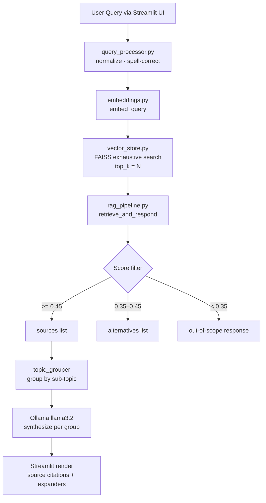
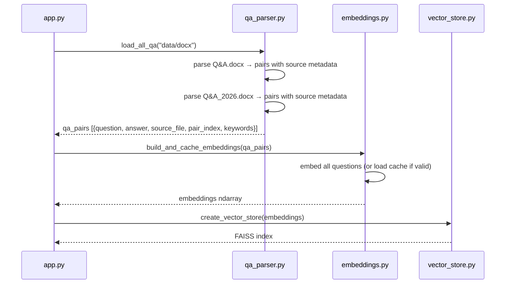
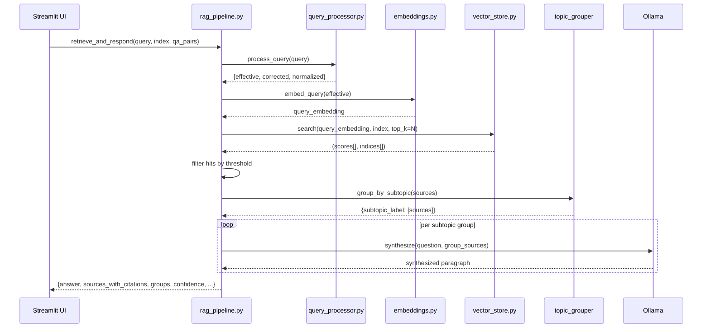

# Design Document: Crystallography Q&A Chatbot

## Overview

A domain-specific RAG chatbot that answers crystallography questions by exhaustively searching two curated Q&A knowledge bases (`Q&A.docx` and `Q&A_2026.docx`). It uses semantic embeddings (all-MiniLM-L6-v2) and FAISS for retrieval, groups results by sub-topic, synthesizes expert-level responses via Ollama (llama3.2), and always cites the exact source question and file for every answer block.

The system is built on an existing Python/Streamlit stack and must not change the runtime environment. All enhancements are additive — extending current modules rather than replacing them.

## Architecture



## Sequence Diagrams

### Startup / Index Build



### Query → Answer Flow



## Components and Interfaces

### qa_parser.py — Extended

**Purpose**: Parse both `.docx` files into structured Q&A pairs with full source provenance.

**Interface**:
```python
def parse_qa_file(filepath: str) -> list[dict]:
    """
    Returns list of:
    {
        "question":   str,
        "answer":     str,
        "keywords":   list[str],
        "source_file": str,   # basename, e.g. "Q&A_2026.docx"
        "pair_index": int,    # 1-based index within that file
    }
    """

def load_all_qa(data_dir: str = "data/docx") -> list[dict]:
    """
    Loads all .docx files, attaches source metadata, deduplicates.
    Returns merged list preserving per-file pair_index.
    """
```

**Responsibilities**:
- Attach `source_file` (basename) and `pair_index` (1-based, per file) to every pair
- Deduplicate across files by normalized question text
- Preserve original pair ordering within each file

---

### embeddings.py — Extended

**Purpose**: Embed question text AND answer text for richer semantic matching.

**Interface**:
```python
def build_and_cache_embeddings(qa_pairs: list[dict]) -> np.ndarray:
    """
    Embeds combined 'question + answer' text per pair.
    Cache key includes both question count and a content hash.
    Returns (N, 384) float32 array.
    """

def embed_query(query: str) -> np.ndarray:
    """Returns (1, 384) normalized embedding."""
```

**Responsibilities**:
- Embed `question + " " + answer[:300]` so answer text participates in retrieval
- Invalidate cache when source content changes (hash-based, not just count-based)
- Normalize all embeddings for cosine similarity via inner product

---

### vector_store.py — Unchanged

**Purpose**: FAISS IndexFlatIP for exhaustive cosine similarity search.

**Interface**:
```python
def create_vector_store(embeddings: np.ndarray) -> faiss.IndexFlatIP
def search(query_embedding, index, top_k: int) -> tuple[np.ndarray, np.ndarray]
```

No changes needed — exhaustive search is already the default with `IndexFlatIP`.

---

### rag_pipeline.py — Extended

**Purpose**: Orchestrate retrieval, topic grouping, per-group synthesis, and citation assembly.

**Interface**:
```python
def retrieve_and_respond(
    user_query: str,
    index: faiss.IndexFlatIP,
    qa_pairs: list[dict],
    top_k: int | None = None,   # None = full dataset scan
) -> dict:
    """
    Returns:
    {
        "answer":               str,   # full synthesized markdown response
        "confidence":           float,
        "matched_question":     str,
        "sources":              list[SourceEntry],
        "alternatives":         list[AltEntry],
        "did_you_mean":         str | None,
        "clarification_needed": bool,
        "query_info":           dict,
        "topic_groups":         dict[str, list[SourceEntry]],  # NEW
    }
    """
```

**Responsibilities**:
- Search entire index (top_k = len(qa_pairs))
- Filter: sources ≥ 0.45, alternatives 0.35–0.45, discard < 0.35
- Delegate grouping to `topic_grouper`
- Call LLM once per group with group-specific context
- Assemble final answer as concatenated group sections with headers
- Never call LLM when zero sources pass threshold

---

### topic_grouper.py — New Module

**Purpose**: Cluster retrieved Q&A pairs into coherent sub-topics before synthesis.

**Interface**:
```python
def group_by_subtopic(
    sources: list[dict],
    query: str,
) -> dict[str, list[dict]]:
    """
    Groups sources into sub-topic buckets.
    Returns OrderedDict: {label: [source, ...]} sorted by max confidence desc.
    Each source dict includes 'source_file' and 'pair_index' for citation.
    """
```

**Grouping Strategy**:
- Primary: keyword overlap between source questions (shared crystallography terms)
- Secondary: embedding cosine similarity between source question embeddings
- Fallback: single group "General" when ≤ 2 sources
- Group labels are short noun phrases derived from the dominant keywords in each cluster (e.g. "Phase Problem", "Twinning — Detection", "Data Collection")

---

### app.py — Extended

**Purpose**: Streamlit UI with per-group rendering and inline source citations.

**Rendering contract**:
```python
def render_result(result: dict):
    # For each group in result["topic_groups"]:
    #   - Render section header (## Sub-topic Label)
    #   - Render synthesized paragraph for that group
    #   - Render inline citation block per source:
    #       "Source: Q{pair_index} from {source_file} ({confidence:.0%})"
    # Render alternatives expander
    # Render spell-correction hint if applicable
```

## Data Models

### QAPair

```python
{
    "question":    str,          # original question text
    "answer":      str,          # full answer text
    "keywords":    list[str],    # extracted meaningful words
    "source_file": str,          # e.g. "Q&A.docx" or "Q&A_2026.docx"
    "pair_index":  int,          # 1-based index within source file
}
```

### SourceEntry (in pipeline response)

```python
{
    "question":    str,
    "answer":      str,
    "confidence":  float,        # cosine similarity score
    "source_file": str,
    "pair_index":  int,
    "citation":    str,          # e.g. "Q47 from Q&A_2026.docx"
}
```

### TopicGroup

```python
{
    "label":      str,           # human-readable sub-topic label
    "sources":    list[SourceEntry],
    "synthesis":  str,           # LLM-generated paragraph for this group
}
```

### PipelineResponse

```python
{
    "answer":               str,
    "confidence":           float,
    "matched_question":     str | None,
    "sources":              list[SourceEntry],
    "alternatives":         list[dict],
    "did_you_mean":         str | None,
    "clarification_needed": bool,
    "query_info":           dict,
    "topic_groups":         dict[str, list[SourceEntry]],
}
```

## Algorithmic Pseudocode

### Main Retrieval + Grouping Algorithm

```pascal
ALGORITHM retrieve_and_respond(user_query, index, qa_pairs)
INPUT: user_query: String, index: FAISSIndex, qa_pairs: List[QAPair]
OUTPUT: PipelineResponse

BEGIN
  // Step 1: Normalize and embed
  processed ← process_query(user_query)
  q_emb ← embed_query(processed.effective)

  // Step 2: Exhaustive search — scan entire dataset
  N ← len(qa_pairs)
  scores[], indices[] ← index.search(q_emb, top_k=N)

  ASSERT len(scores) = N AND len(indices) = N

  // Step 3: Filter by threshold
  sources ← []
  alternatives ← []
  FOR i IN 0..N-1 DO
    s ← scores[i]
    idx ← indices[i]
    IF s >= HIGH_CONFIDENCE OR s >= MID_CONFIDENCE THEN
      sources.append(qa_pairs[idx] WITH confidence=s)
    ELSE IF s >= LOW_CONFIDENCE THEN
      alternatives.append({question: qa_pairs[idx].question, confidence: s})
    END IF
  END FOR

  IF sources IS EMPTY THEN
    RETURN out_of_scope_response(alternatives)
  END IF

  // Step 4: Group by sub-topic
  groups ← group_by_subtopic(sources, user_query)

  // Step 5: Synthesize per group — no cross-group blending
  answer_sections ← []
  FOR label, group_sources IN groups DO
    section ← synthesize_group(user_query, label, group_sources)
    answer_sections.append(section)
  END FOR

  // Step 6: Assemble final answer
  answer ← join(answer_sections, separator="\n\n---\n\n")

  RETURN PipelineResponse{
    answer: answer,
    sources: sources,
    topic_groups: groups,
    ...
  }
END
```

**Preconditions**:
- `index` contains exactly `len(qa_pairs)` vectors
- All embeddings are L2-normalized (cosine sim = inner product)
- `qa_pairs` entries have `source_file` and `pair_index` populated

**Postconditions**:
- Every source in `sources` has `confidence >= MID_CONFIDENCE`
- Every group in `topic_groups` has at least one source
- `answer` contains one section per group, never blending across groups
- If `sources` is empty, `answer` is the out-of-scope message

**Loop Invariants**:
- All appended sources have `confidence >= MID_CONFIDENCE`
- `alternatives` contains only entries with `MID_CONFIDENCE > confidence >= LOW_CONFIDENCE`

---

### Topic Grouping Algorithm

```pascal
ALGORITHM group_by_subtopic(sources, query)
INPUT: sources: List[SourceEntry], query: String
OUTPUT: OrderedDict[String → List[SourceEntry]]

BEGIN
  IF len(sources) <= 2 THEN
    RETURN {"General": sources}
  END IF

  // Build keyword sets per source
  FOR each src IN sources DO
    src.kw_set ← set(src.keywords)
  END FOR

  // Greedy clustering by keyword overlap
  clusters ← []
  assigned ← set()

  FOR i IN 0..len(sources)-1 DO
    IF i IN assigned THEN CONTINUE END IF
    cluster ← [sources[i]]
    assigned.add(i)
    FOR j IN i+1..len(sources)-1 DO
      IF j IN assigned THEN CONTINUE END IF
      overlap ← |sources[i].kw_set ∩ sources[j].kw_set|
      IF overlap >= MIN_OVERLAP_THRESHOLD THEN
        cluster.append(sources[j])
        assigned.add(j)
      END IF
    END FOR
    clusters.append(cluster)
  END FOR

  // Label each cluster from dominant keywords
  result ← OrderedDict()
  FOR cluster IN clusters SORTED BY max(src.confidence) DESC DO
    label ← derive_label(cluster)
    result[label] ← cluster
  END FOR

  RETURN result
END
```

**Preconditions**:
- `sources` is non-empty
- Each source has `keywords` list populated

**Postconditions**:
- Every source appears in exactly one group
- Groups are ordered by descending max confidence
- Labels are non-empty strings

---

### Per-Group LLM Synthesis

```pascal
ALGORITHM synthesize_group(user_query, label, group_sources)
INPUT: user_query: String, label: String, group_sources: List[SourceEntry]
OUTPUT: String (markdown section)

BEGIN
  context_blocks ← []
  FOR src IN group_sources DO
    citation ← "Q" + src.pair_index + " from " + src.source_file
    context_blocks.append(
      "--- " + citation + " (relevance: " + src.confidence + ") ---\n" +
      "Q: " + src.question + "\n" +
      "A: " + src.answer
    )
  END FOR

  prompt ← build_synthesis_prompt(user_query, label, context_blocks)
  llm_response ← ollama.chat(model="llama3.2:latest", prompt=prompt)

  // Build citation footer
  citations ← ["Source: " + src.citation + " (" + src.confidence + ")"
                FOR src IN group_sources]

  section ← "### " + label + "\n\n" +
             llm_response + "\n\n" +
             join(citations, "\n")

  RETURN section
END
```

**Preconditions**:
- `group_sources` is non-empty
- Each source has `citation` string pre-computed

**Postconditions**:
- Returned section starts with `### {label}` header
- Every source in `group_sources` has a citation line in the output
- LLM output uses only information from `context_blocks`

## Key Functions with Formal Specifications

### `parse_qa_file(filepath)`

**Preconditions**:
- `filepath` points to a readable `.docx` file
- File contains Q./A. delimited pairs

**Postconditions**:
- Every returned dict has non-empty `question`, `answer`, `source_file`, `pair_index`
- `pair_index` is 1-based and unique within the file
- `source_file` equals `os.path.basename(filepath)`

---

### `build_and_cache_embeddings(qa_pairs)`

**Preconditions**:
- `qa_pairs` is non-empty
- Each pair has `question` and `answer` fields

**Postconditions**:
- Returns float32 array of shape `(len(qa_pairs), 384)`
- All rows are L2-normalized (norm ≈ 1.0)
- Cache is written to `database/qa_embeddings.pkl`
- Cache is invalidated if content hash changes

---

### `group_by_subtopic(sources, query)`

**Preconditions**:
- `sources` is non-empty list of SourceEntry dicts
- Each source has `keywords` list

**Postconditions**:
- Union of all group values equals `sources` (no source lost or duplicated)
- Each group has at least one source
- Groups ordered by descending max confidence

---

### `retrieve_and_respond(user_query, index, qa_pairs, top_k=None)`

**Preconditions**:
- `index.ntotal == len(qa_pairs)`
- `user_query` is non-empty string

**Postconditions**:
- If no sources pass threshold: `answer` is out-of-scope message, `sources == []`
- If sources exist: `answer` contains one `###` section per topic group
- Every source in `sources` appears cited in `answer`
- `confidence` equals max score across all hits

## Example Usage

```python
# Startup
qa_pairs = load_all_qa("data/docx")
# qa_pairs[0] == {
#   "question": "What is the phase problem in crystallography?",
#   "answer": "The phase problem arises because...",
#   "source_file": "Q&A.docx",
#   "pair_index": 1,
#   "keywords": ["phase", "problem", "crystallography", ...]
# }

embeddings = build_and_cache_embeddings(qa_pairs)
index = create_vector_store(embeddings)

# Query
result = retrieve_and_respond("phase problem", index, qa_pairs)

# result["answer"] example:
# ### Phase Problem — Fundamentals
#
# The phase problem is a fundamental challenge in X-ray crystallography...
# [synthesized expert paragraph]
#
# Source: Q1 from Q&A.docx (92%)
# Source: Q14 from Q&A_2026.docx (87%)
#
# ---
#
# ### Phase Problem — Solution Methods
#
# Several methods exist to overcome the phase problem, including...
#
# Source: Q8 from Q&A.docx (81%)
```

## Correctness Properties

1. **Exhaustive retrieval**: For any query, `top_k` passed to FAISS equals `len(qa_pairs)` — no early stopping.
2. **Source completeness**: Every entry in `result["sources"]` has non-null `source_file` and `pair_index`.
3. **Citation coverage**: Every source in `result["sources"]` is cited at least once in `result["answer"]`.
4. **No cross-group blending**: Each LLM call receives only sources from a single topic group.
5. **No hallucination gate**: LLM is only called when `len(sources) > 0`; otherwise the out-of-scope message is returned verbatim.
6. **Partition invariant**: The union of all topic groups equals `result["sources"]` with no duplicates.
7. **Cache validity**: Embeddings cache is invalidated when the content hash of all questions+answers changes.
8. **Score monotonicity**: `result["confidence"]` equals `max(s["confidence"] for s in result["sources"])`.

## Error Handling

### Scenario 1: Ollama unavailable

**Condition**: `ollama.chat()` raises an exception  
**Response**: Fall back to formatted raw Q&A dump (existing behavior in `_build_answer`)  
**Recovery**: Each source's question + answer rendered as bold header + paragraph; citations still shown

### Scenario 2: No matches above threshold

**Condition**: All cosine scores < 0.35  
**Response**: `"This specific topic isn't covered in the current Q&A dataset."` (steering rule)  
**Recovery**: Show alternatives expander if any scores in 0.35–0.45 range

### Scenario 3: Malformed .docx file

**Condition**: `parse_qa_file` finds no Q./A. delimited pairs  
**Response**: Log warning, return empty list for that file; other file still loads  
**Recovery**: App continues with partial dataset; startup banner shows pair count

### Scenario 4: Cache corruption

**Condition**: `pickle.load` raises exception on cached embeddings  
**Response**: Delete corrupt cache, rebuild embeddings from scratch  
**Recovery**: Transparent to user — slightly slower startup

### Scenario 5: Empty query

**Condition**: User submits whitespace-only input  
**Response**: Streamlit `st.chat_input` prevents empty submission natively  
**Recovery**: No pipeline call made

## Testing Strategy

### Unit Testing Approach

- `test_qa_parser.py`: Verify `source_file` and `pair_index` are correctly attached; test deduplication across files
- `test_topic_grouper.py`: Verify partition invariant; test single-source and two-source edge cases; test label derivation
- `test_rag_pipeline.py`: Mock FAISS index; verify threshold filtering; verify out-of-scope path; verify citation assembly

### Property-Based Testing Approach

**Property Test Library**: `hypothesis`

- **Partition property**: For any non-empty sources list, `group_by_subtopic` returns groups whose union equals the input
- **Citation property**: For any pipeline response with sources, every `pair_index`+`source_file` pair appears in `answer`
- **Threshold property**: No source with score < `MID_CONFIDENCE` appears in `result["sources"]`

### Integration Testing Approach

- `test_pipeline.py` (existing): Extend to assert `source_file` present in all returned sources
- End-to-end smoke test: Load real `.docx` files, run 5 representative queries, assert non-empty grouped answer

## Performance Considerations

- Embedding model (`all-MiniLM-L6-v2`) loads once via `@st.cache_resource` — no per-query reload
- FAISS `IndexFlatIP` is O(N·d) per query; with ~500 pairs and d=384 this is <5ms — exhaustive scan is fine
- Embedding cache uses content hash to avoid re-encoding on restart when data hasn't changed
- LLM calls are the bottleneck (~1–3s each); grouping reduces calls vs. one-call-per-source approaches
- Topic grouper runs in O(N²) on sources list; N is bounded by dataset size (~500), so this is negligible

## Security Considerations

- No user data is persisted beyond the Streamlit session state
- `.docx` files are read-only at startup; no user-supplied file paths
- Ollama runs locally — no external API calls, no data leaves the machine
- `pickle` cache is written to `database/` which should not be web-accessible

## Dependencies

| Package | Version | Purpose |
|---|---|---|
| `streamlit` | existing | UI framework |
| `sentence-transformers` | existing | all-MiniLM-L6-v2 embeddings |
| `faiss-cpu` | existing | vector similarity search |
| `ollama` | existing | local LLM inference |
| `docx2txt` | existing | .docx text extraction |
| `rapidfuzz` | existing | spell correction |
| `nltk` | existing | stopwords |
| `hypothesis` | new (dev) | property-based testing |
| `numpy` | existing | array operations |
